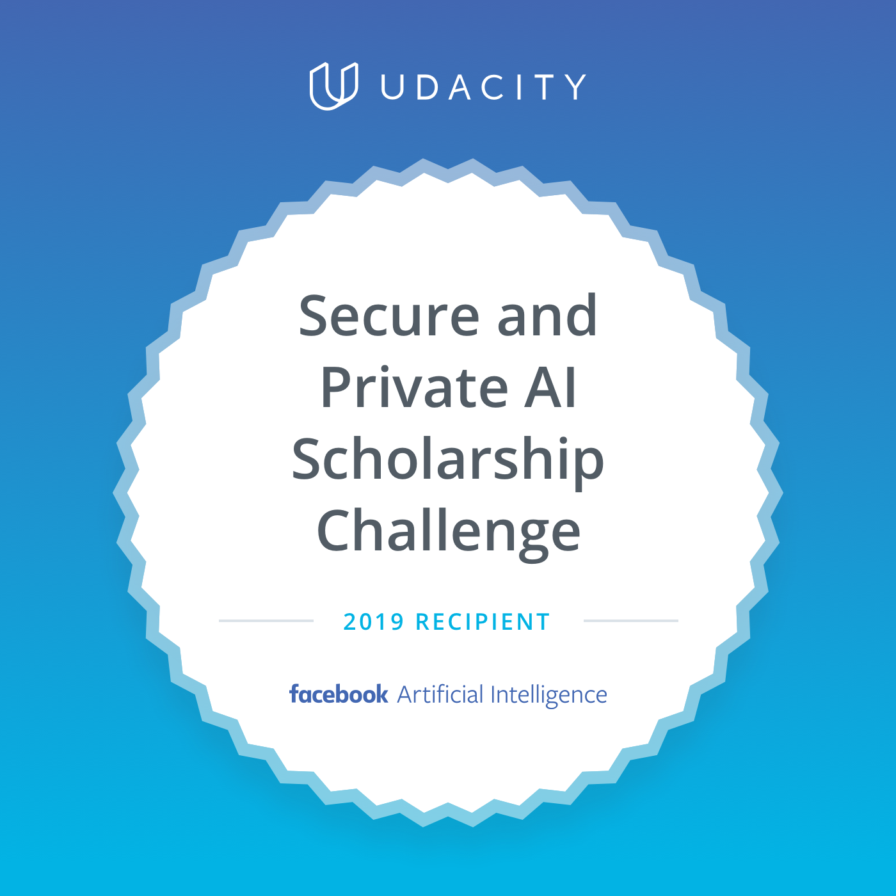

# Secure and Private AI Scholarship Challenge 2019 Notes

  

A collection of notes on Secure and Private AI Scholarship Challenge 2019.

Contributions are always welcome!

<!-- toc -->

- [Lesson 3: Introducing Differential Privacy](#lesson-3-introducing-differential-privacy)
  * [Secure & Private AI Program Introduction](#secure--private-ai-program-introduction)
  * [Lesson 1 Introduction](#lesson-1-introduction)
  * [What Is Differential Privacy (DP)](#what-is-differential-privacy-dp)
  * [Can We Just Anonymize Data](#can-we-just-anonymize-data)
  * [Introducing The Canonical Database](#introducing-the-canonical-database)
  * [Project Intro Build A Private Database In Python](#project-intro-build-a-private-database-in-python)
  * [Notebook Exercise Instructions](#notebook-exercise-instructions)
  * [Project Demo Build A Private Database In Python](#project-demo-build-a-private-database-in-python)
- [Lesson 4: Evaluating the Privacy of a Function](#lesson-4-evaluating-the-privacy-of-a-function)
  * [Evaluating The Privacy Of A Function](#evaluating-the-privacy-of-a-function)
  * [Project Intro Evaluating The Privacy Of A Function](#project-intro-evaluating-the-privacy-of-a-function)
  * [Project Demo Evaluating The Privacy Of A Function](#project-demo-evaluating-the-privacy-of-a-function)
  * [Project Intro Calculate L1 Sensitivity For Threshold](#project-intro-calculate-l1-sensitivity-for-threshold)
  * [Project Demo Calculate L1 Sensitivity For Threshold](#project-demo-calculate-l1-sensitivity-for-threshold)
  * [Project Intro Perform A Differencing Attack](#project-intro-perform-a-differencing-attack)
  * [Project Demo Perform A Differencing Attack](#project-demo-perform-a-differencing-attack)
- [Lesson 5: Introducing Local and Global Differential Privacy](#lesson-5-introducing-local-and-global-differential-privacy)
  * [Introducing Local and Global Differential Privacy](#introducing-local-and-global-differential-privacy)
  * [Making a Function Differentially Private](#making-a-function-differentially-private)
  * [Project Intro Implement Local Differential Privacy](#project-intro-implement-local-differential-privacy)
  * [Project Demo Implement Local Differential Privacy](#project-demo-implement-local-differential-privacy)
  * [Project Intro Varying the Amount of Noise](#project-intro-varying-the-amount-of-noise)
  * [Project Demo Varying the Amount of Noise](#project-demo-varying-the-amount-of-noise)
  * [The Formal Definition of Differential Privacy](#the-formal-definition-of-differential-privacy)
  * [Create a Differentially Private Query](#create-a-differentially-private-query)
  * [Project Demo Create a Differentially Private Query](#project-demo-create-a-differentially-private-query)
- [Lesson 6: Differential Privacy for Deep Learning](#lesson-6-differential-privacy-for-deep-learning)
- [Lesson 7: Federated Learning](#lesson-7-federated-learning)
- [Lesson 8: Securing Federated Learning](#lesson-8-securing-federated-learning)
- [Lesson 9: Encrypted Deep Learning](#lesson-9-encrypted-deep-learning)
- [Resources](#resources)
- [Credits](#credits)

<!-- tocstop -->

## Lesson 3: Introducing Differential Privacy
### Secure & Private AI Program Introduction
* When doing artificial intelligence in the real world, most datasets are siloed (isolated) within large enterprises for two reasons:
  1. Enterprises have a legal risk which prevents them form wanting to share their dataset outside their organization
  2. Enterprises have a competitive advantage to hang onto large datasets collected from/about their customers

### Lesson 1 Introduction
* In this lesson we're going to be talking about differential privacy in the context of deep learning.
* In this context, differential privacy is about ensuring that when our neural networks are learning from sensitive data, they're only learning what they're supposed to learn from the data.

### What Is Differential Privacy (DP)
* It's a new field, recently started with statistical database queries around 2003 and even more recently
* General goal of DP is to ensure that different kinds of statistical analysis don't co mpromise privacy
* Privacy is preserved if
  
  After the analysis, the analyzer doesn't know anything about the people in the dataset. They remain "unobserved"
* Dalenius's Ad Omnia Guarantee (1977)
  
  Anything that can be learned about a participant from the statistical database can be learned without access to the database
* Above definition is basically saying, anything you actually do learn about a person should be only public information
* Cynthia Dwork, Algorithmic Foundations of Differential Privacy
  
  "Differential Privacy" describes a promise, made by a data holder, or curator, to a data subject, and the promise is like this: "You will not be affected, adversely or otherwiese, by allowing your data to be used in any study or analysis, no matter what other sudies, data sets, or information sources, are available"
* True goal of DP is to propose these tools and techniques that allow a data holder to make these promises to individuals who are being studied.

### Can We Just Anonymize Data
* We can't just anonymize data because if someone else releases a related anonymized private dataset, often it can be possible to divulge the private aspects of the information you're trying to hide by studiying these two separate dataset releases.

### Introducing The Canonical Database
* Simple (canonical) database is A database with a single column with one row for each person
* If we remove a person from the database, and the query does not change, then that person's privacy is fully protected.
* If the query doesn't change even we remove someone from the database, then that person wasn't leaking any statistical information into the output of the query.

### Project Intro Build A Private Database In Python
* Write a sort of function that makes it so that you can take this database and create 5000 other databases each with one person missing
* You should end up with 5000 databases of length 4999

### Notebook Exercise Instructions

### Project Demo Build A Private Database In Python
* [Project: Generate Parallel Databases](https://colab.research.google.com/github/agungsantoso/private-ai/blob/master/Section%201%20-%20Differential%20Privacy.ipynb#)

## Lesson 4: Evaluating the Privacy of a Function
### Evaluating The Privacy Of A Function
* Compare the output of the query on the entire database with the output of the query on each of the parallel databases
* Sensitivity (L1) is the maximum amount that the query changes when removing an individual from the database
* The output of the sum is conditioned on every individual that is a 1 in the database

### Project Intro Evaluating The Privacy Of A Function
* Create a single function called sensitivity (query, n_entries)
  * Initialize a database of correct size
  * Initialize all parallel databases
  * Run the query over all databases
  * Correctly calculate sensitivity
  * Return the sensitivity

### Project Demo Evaluating The Privacy Of A Function
* [Project - Evaluating the Privacy of a Function](https://colab.research.google.com/github/agungsantoso/private-ai/blob/master/Section%201%20-%20Differential%20Privacy.ipynb)

### Project Intro Calculate L1 Sensitivity For Threshold
* Project 3
  * Create the query() function
  * Create 10 databases of size 10
  * Query each database with a threshold of 5 (calculate sensitivity)
  * Print out the sensitivity of each database

### Project Demo Calculate L1 Sensitivity For Threshold
* [Project: Calculate L1 Sensitivity For Threshold](https://colab.research.google.com/github/agungsantoso/private-ai/blob/master/Section%201%20-%20Differential%20Privacy.ipynb)

### Project Intro Perform A Differencing Attack
* In this concept, we're going to explore how to compromise or attack differential privacy
* All we would have to do is query for the sum of the entire database and then the sum of the entire database without that person. In SQL, this might look something like this
  * SELECT count(*) from my_cancer_database;
  * SELECT count(*) from my_cancer_database WHERE person_name != "john doe";
* The purpose of this exercise is to give you an intuition for how privacy can fail in these environments.

### Project Demo Perform A Differencing Attack
* [Project: Perform a Differencing Attack on Row 10](https://colab.research.google.com/github/agungsantoso/private-ai/blob/master/Section%201%20-%20Differential%20Privacy.ipynb)

## Lesson 5: Introducing Local and Global Differential Privacy
### Introducing Local and Global Differential Privacy
* Local Differential Privacy adds noise to function data points (function inputs)
* Global Differential Privacy adds noise to function outputs
* Trusted Curator is an owner of a database upon which Global Differential privacy is applied. They are trusted to apply DP correctly.

### Making a Function Differentially Private
* Differential Privacy always requires a form of randomness or noise added to the query to protect from things like Differencing Attacks.
* Randomized Response is technique that is used in social sciences when trying to learn about the high level trends for a taboo behavior
  * Have you ever jaywalked, perhaps in the last week?
* Plausible Deniability
  * Flip a coin two times
  * If the first coin flip is heads, answer (yes/no) honestly
  * If the first coin flip is tails, answer according to the second coin flip
* Differential Privacy
  * Most accurate query with the greatest amount of privacy
  * Greatest fit with trust models in the actual world (don't waste trust)

### Project Intro Implement Local Differential Privacy
* Implement randomized response in our database
* Flip two coins by generate two random 1/0 responses in Python
* Report both the true query and the noised query for database sizes 10, 100, 1000, and 10,000

### Project Demo Implement Local Differential Privacy
* [Project: Local Differential Privacy](https://colab.research.google.com/github/agungsantoso/private-ai/blob/master/Section%201%20-%20Differential%20Privacy.ipynb)

### Project Intro Varying the Amount of Noise
* Augment the randomized response query from the previous project to allow for varying amounts of randomness to be added
* Varying the amount of noise
  * Add a new parameter to the query function. It will now accept the database and some noise parameter which is percentage
  * Properly rebalance the result of the query given this adjustable parameter

### Project Demo Varying the Amount of Noise
* [Project: Varying Amounts of Noise](https://colab.research.google.com/github/agungsantoso/private-ai/blob/master/Section%201%20-%20Differential%20Privacy.ipynb)

### The Formal Definition of Differential Privacy
* What we cover so far
  * Local Differential Privacy
  * Differencing Attack
  * Basic queries
  * Sensitivity
  * Differential Privacy definition
  * Global Differential Privacy
* How much noise should we add after the query has been run?
* "Epsilon" and "Delta" measure a threshold for leakage

### Create a Differentially Private Query
* How do we actually use epsilon and delta?
* Randomized mechanism is a function with random noise added to its inputs, outputs, and/or inner workings.
* Global Differential Privacy adds noise to the output of a query.
* Local Differential Privacy adds noise to each data input to the query.
* Privacy budget is how much epsilon/delta leakage we allow for our analysis
* Types of noise
  * Gaussian
  * Laplacian
* How much noise should we add?
  * Type of Noise (Gaussian/Laplacian)
  * Sensitivity of Query
  * Desired Epsilon (E)
  * Desired Delta (d)
* Laplacian noise
  * b = sensitivity(query)/epsilon
  * d always zero
* Laplace function: `np.random.laplace`

### Project Demo Create a Differentially Private Query
* [Project: Create a Differentially Private Query](https://colab.research.google.com/github/agungsantoso/private-ai/blob/master/Section%201%20-%20Differential%20Privacy.ipynb)

## Lesson 6: Differential Privacy for Deep Learning

## Lesson 7: Federated Learning

## Lesson 8: Securing Federated Learning

## Lesson 9: Encrypted Deep Learning

## Resources

## Credits
1. Images and notes taken from lectures videos at [Secure and Private AI](https://www.udacity.com/course/secure-and-private-ai--ud185)